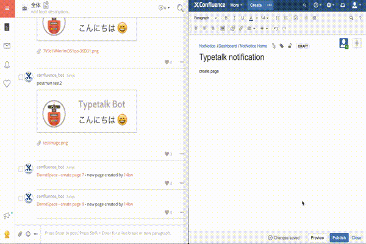

# Typetalk for Confluence

## Install

Build with `atlas compile && atlas-package` and install by clicking "Upload add-on" in the "Manage add-ons" section in Confluence Administration.

## Configure

Configure notification webhookUrl(post message URL) in the Space Administration Add-on.

ex: https://typetalk.com/api/v1/topics/00000?typetalkToken=xxxxxx

## Notification Action

* Create page/blog
* Updata page/blog (notice watcher)